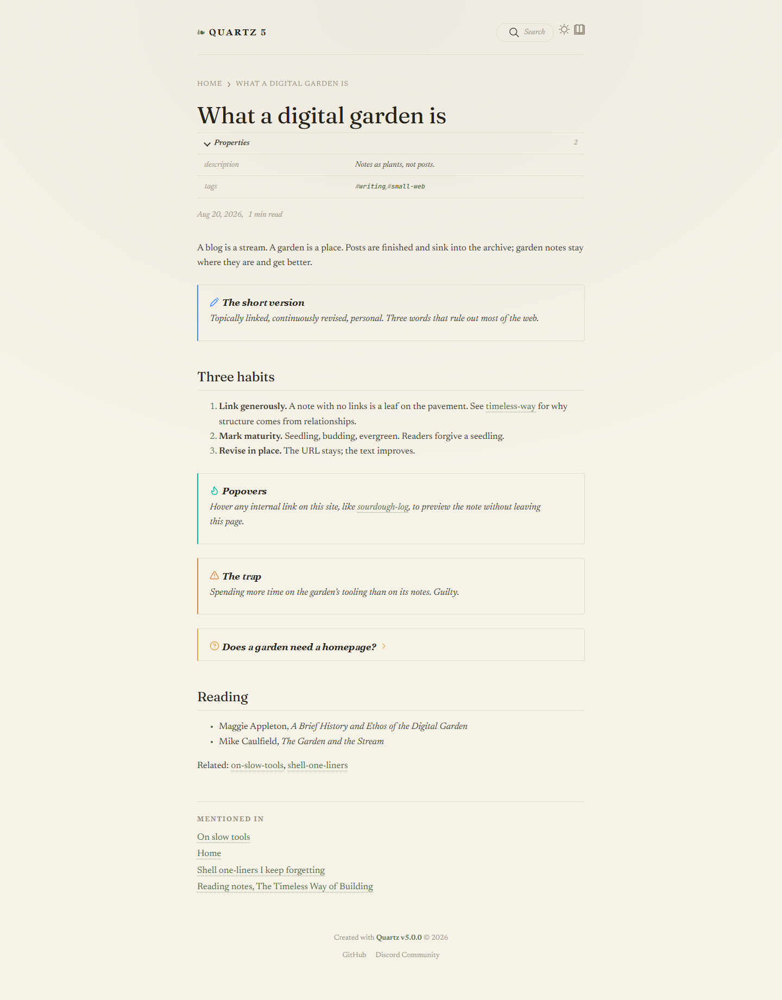

# Field Notes, a theme for Quartz 5 (free edition)



One warm reading column, book margins, fleurons, dotted ink links. For gardens that want to read like a well-set paperback. This is the complete Field Notes theme in its moss palette, free.

The full pack adds the slate palette, plus two more themes: **Phosphor** (a terminal, with panels, a blinking cursor and scanlines) and **Broadsheet** (a newspaper, with masthead, drop caps and pull quotes). Pay what you want: https://opensourcewarren.gumroad.com/l/quartz5-themes

Built and tested against Quartz v5.0.0. Requires Node 22 or newer (Quartz 5 already does).

## Install in two minutes

1. Clone or download this repository anywhere. You do not need to put it inside your Quartz folder.
2. Open a terminal **in your Quartz folder** (the one with `quartz.config.yaml`).
3. Run the installer, pointing at the unzipped folder:

   ```bash
   node /path/to/quartz5-themes/apply-theme.mjs field-notes
   ```

   4. Build as usual:

   ```bash
   npx quartz build --serve
   ```

Switching never stacks: every run starts from a snapshot of your original files.

```bash
node /path/to/quartz5-themes/apply-theme.mjs --list      # themes and palettes
node /path/to/quartz5-themes/apply-theme.mjs --restore   # put everything back
```

## What the installer touches

Exactly two files, nothing else:

- `quartz/styles/custom.scss` is replaced with the theme's stylesheet.
- `quartz.config.yaml` gets new values under `configuration.theme.typography` and `configuration.theme.colors`. Comments, plugin settings, and ordering are preserved.

The first run copies both originals to `.quartz-themes-backup/` in your Quartz folder. `--restore` copies them back byte-for-byte and removes the backup folder.

No plugin is installed, enabled, or disabled. No dependency is added: the installer uses the `yaml` package Quartz already ships with.

## The tip you would otherwise miss

Quartz 5's stock config ships with the `quartz-fonts` plugin enabled. That plugin writes its own font variables and a hard-coded `h1 { font-family }` rule, and it wins over `configuration.theme.typography`. On a default install, changing fonts in the config quietly does nothing: headings stay in Schibsted Grotesk.

These themes work around it by declaring their fonts in the stylesheet with enough weight to win. If you later set `header`, `body`, or `code` options on the fonts plugin itself, those will override the theme; either leave the plugin at its defaults or set its options to match the theme's fonts (listed in each `themes/field-notes/theme.json`).

## Manual install (no installer)

If you would rather not run a script:

1. Copy `themes/field-notes/custom.scss` over `quartz/styles/custom.scss`.
2. Open `themes/field-notes/theme.json`, copy `typography` and the palette you want into the matching keys under `configuration.theme` in `quartz.config.yaml` (the palette's `lightMode` and `darkMode` go under `colors`).

## Customising

See `CUSTOMIZE.md`. Each stylesheet starts with a short block of knobs (column width, ornaments, cursor, scanlines, drop cap, labels). Colours live in the config, so you can change an accent without touching SCSS.

## Known Quartz 5 quirks (not theme bugs, but you will notice them)

- **Pages load scrolled down when the Explorer is enabled.** The stock explorer calls `scrollIntoView()` on the active entry when a page loads, and the browser scrolls the whole window to do it. You can see it on a stock Quartz 5 site too. Field Notes hides the explorer, so it does not show there.
- **A `|` inside a wikilink breaks Markdown tables.** Write `[[note\|alias]]` inside table cells, the same as in Obsidian.

## What is in this repository

```
quartz-field-notes/
  apply-theme.mjs          the installer
  README.md                this file
  CUSTOMIZE.md             the knobs
  LICENSE.txt
  themes/
    field-notes/  custom.scss + theme.json
```

## Updating Quartz later

The themes only rely on Quartz's public class names (`.page-title`, `.sidebar`, `.callout`, `.backlinks`, and so on). Minor Quartz updates should be fine. If a future Quartz release renames its markup, the worst case is an unstyled component, never a broken build: the stylesheet compiles independently of the content.

Questions or a broken build: open an issue here (or reply through your Gumroad receipt if you downloaded it there) and say which theme, which palette, and which Quartz version; those get read.

Version 1.0, August 2026.
